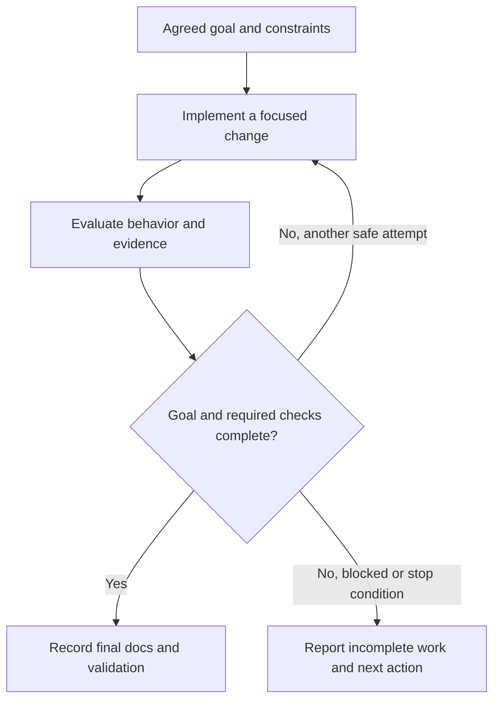

# Agent Workflow Definition

This document defines the repository contract for delegated agent work.

## Scope

Use this contract for delegated work, including repeated attempts, handoffs, multiple sessions, or unattended execution.
Work roles define responsibilities. They may be performed by people, agents, CI, or other tools.
Definition Harness does not supply a runtime, scheduler, sandbox, approval system, or model router.

## Core Rules

- Store final behavior in definitions, stable rationale in principles, and reusable evaluation rules in evaluation definitions when needed.
- Keep `AGENTS.md` as a concise map. Durable knowledge must be available outside chat history.
- Record final validation, docs impact, risks, and follow-up in the PR.
- Execution state may stay in the task, session, or external harness.
- Create repository working files only when the user requests them or explicit repo-local policy requires them.
- Delegation, duration, and multiple sessions or attempts do not require progress files.
- Resolve any working files before closure. Move lasting knowledge into stable docs; delete or intentionally retain the files as history.

## Work Roles

| Role | Responsibility |
| --- | --- |
| Initializer | Read repo guidance and relevant docs. Identify affected scopes, tests, and commands. Establish the goal, constraints, and first safe slice. |
| Implementer | Make focused changes. Align code, tests, docs, and operator instructions with the final behavior. Provide validation evidence. |
| Evaluator | Check behavior against definitions and acceptance criteria in a separate evaluation step. Inspect evidence, documentation drift, untested claims, broken workflows, and risks. Calibrate judgment-based review with humans. |
| Closer | Confirm behavior, tests, docs, and evidence agree. Resolve optional working files and prepare the PR for review. |

One worker may perform several roles. A separate agent process is not required.
Scope changes must update the agreed goal, non-goals, and affected docs.

## Delegated Goal

Establish these fields in the task or external harness:

| Field | Meaning |
| --- | --- |
| Outcome | Desired end state. |
| Verification | Evidence that proves completion. |
| Constraints | Allowed changes and protected behavior. |
| Iteration policy | How to evaluate a result and choose the next safe attempt. Repository attempt logs are optional. |
| Error handling | Conditions for stopping and reporting incomplete work. |

## Evaluation Loop

Arrows show work transitions. Close only when the agreed outcome and required checks pass.

Recheck scope between attempts. Report blockers and incomplete changes through the task, session, or external harness.
Do not present incomplete work as final behavior.

## Evaluation Evidence

Match evidence to the risk: tests, build/lint/type checks, reproducible workloads, before/after measurements, browser scenarios, screenshots, videos, logs, or traces.
For judgment-based work, include rubric scores and reviewer reasoning.

The scope's definition, evaluation definition, development flow, README, or PR template states the required evidence.

### Rubrics

Use a rubric when tests cannot express quality, such as usability, design, writing, or operator judgment.

- Define scoring dimensions and observable criteria.
- Use baseline failures, acceptable examples, and concrete anti-patterns from real review experience.
- Use diverse reference cases to reduce overfitting. Add weights or priorities only when justified.
- Compare evaluator judgments with human review. Revise criteria when they miss repeated failures.

## Optional Progress Tracking

If opted in, follow `documentation/documentation-definition.md` and use `IN_PROGRESS.md` or `*-progress.md`.
Include the goal, non-goals, current state, affected docs, checklist, validation results, decisions, blockers, touched areas, latest handoff, and next action.
Otherwise, the external harness may manage continuation.

## Non-goals

- Vendor-specific orchestration or required multi-agent execution.
- Replacing tests, CI, code review, or runbooks.
- Requiring working artifacts for every task.
